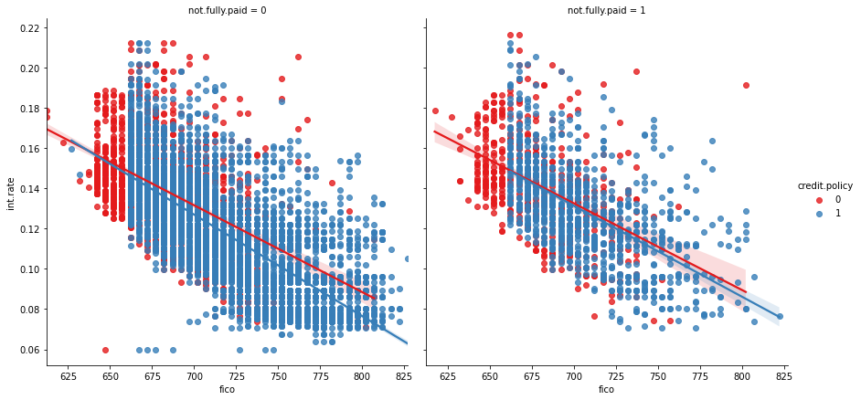

# Loan-prediction-Analysis-EDA
The project is to make use of pandas, matplotlib, & seaborn libraries.
## Expectation from the project 
1.Introduction to the problem(Dataset).

2.Exploratory Data Analysis (EDA) and PreProcessing.

3.Feature engineering and Model building.
# Contents 
1.Decision Tree

2.Random Forest model
### differed between not.fully.paid and credit.policy

